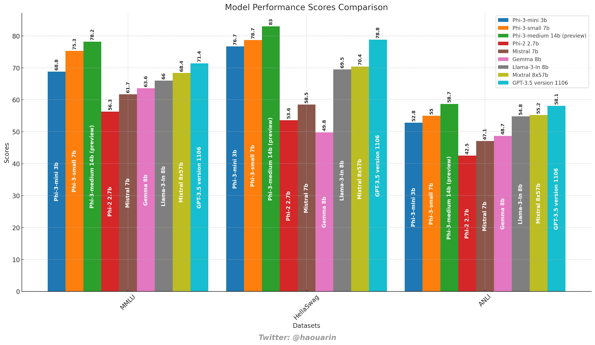

By now you get the point that artificial intelligence gets a lot of attention. Large language models and generative ai provide new capabilities and opporunities to end users. When you hear about how much data, compute and resources are needed, you may ask if that is the most efficient way to help you improve productivity. 

This is why I am excited about small lanuage models (SLM). Last year [Phi2](https://www.microsoft.com/research/blog/phi-2-the-surprising-power-of-small-language-models/) made some impression and now [Phi3](https://arxiv.org/pdf/2404.14219), a highly capable language model that can run on a phone, "rivals with LLMs like GPT3.5". 

[Getting started](https://techcommunity.microsoft.com/t5/microsoft-developer-community/getting-started-generative-ai-with-phi-3-mini-a-guide-to/ba-p/4121315?wt.mc_id=pdebruin_content_blog_cnl_csasci)

[Exploring Phi3 family](https://techcommunity.microsoft.com/t5/educator-developer-blog/exploring-microsoft-s-phi-3-family-of-small-language-models-slms/ba-p/4135879?wt.mc_id=pdebruin_content_blog_cnl_csasci)

Thanks for reading! :-)
