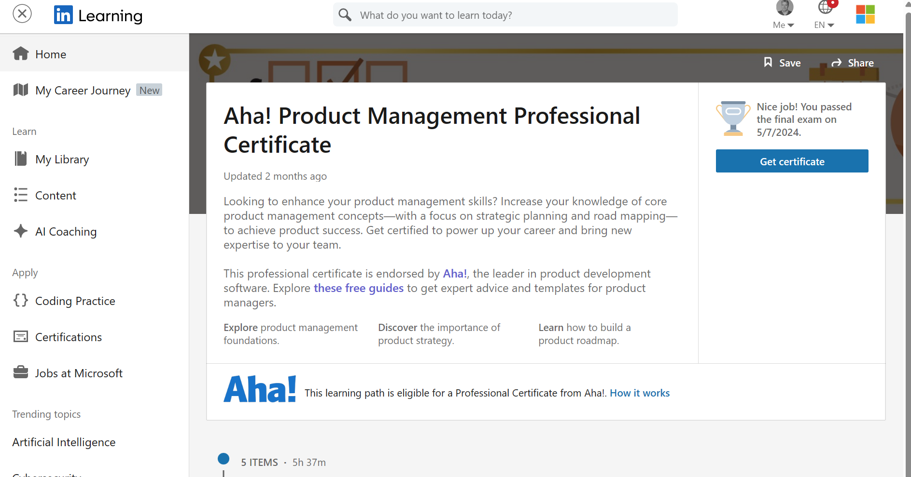

In LinkedIn Learning, I looked at [career journey](https://www.linkedin.com/learning/me/my-plan), which has career goals and role guides. For instance, I entered product manager as career goal, which has a link to the [role guide](https://www.linkedin.com/learning/roles/product-manager). The role guide contains short videos, to understand the basics of the role, and longer courses, to actually learn them. 

Then I also saw it provides certification, which requires following a learning path of 6 hours and passing an exam of 150 questions. Now I love gamification in learning, so I did the learning path and exam. 

As a Microsoft employee, I have access to LinkedIn Learning, and I realize not everybody has. If you do, this post is for you. If you don't and are interested, investigate if you can get trial access. 

[Certificate](https://www.linkedin.com/learning/paths/aha-product-management-professional-certificate)

Thanks for reading! :-)
