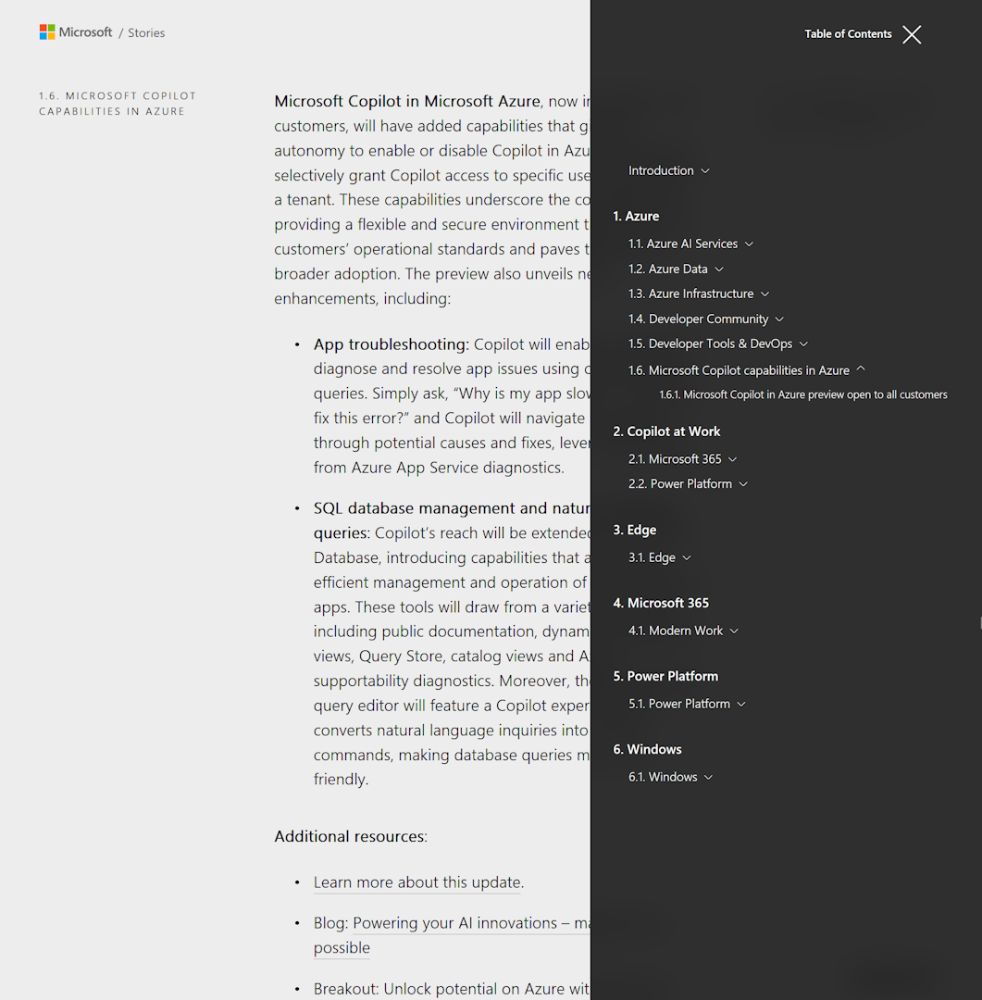

Microsoft Build in May and Ignite in November are the top events organized by Microsoft. To no one's surprise, much of the news at Build this week was about artificial intelligence. Next to that, there were many other notable developments.

For a quick overview of all the announcemnets, see the [book of news](https://news.microsoft.com/build-2024-book-of-news/). 

I am most interested in how the application development space is evolving and love to see the focus on functions and container apps:
* Flex consumption plan with private networking
* Concurrency control
* Azure OpenAI triggers and bindings 
* Dapr triggers and bindings
* Functions on container apps
* Container apps dynamic sessions

[Video](https://build.microsoft.com/sessions/6ee55611-4d2b-4efb-8ead-27099fb60447)

While you are there, also check out other presentations by leaders such as Scott Guthrie, Mark Russinovich, Scott Hanselman, etc.

Thanks for reading! :-)
