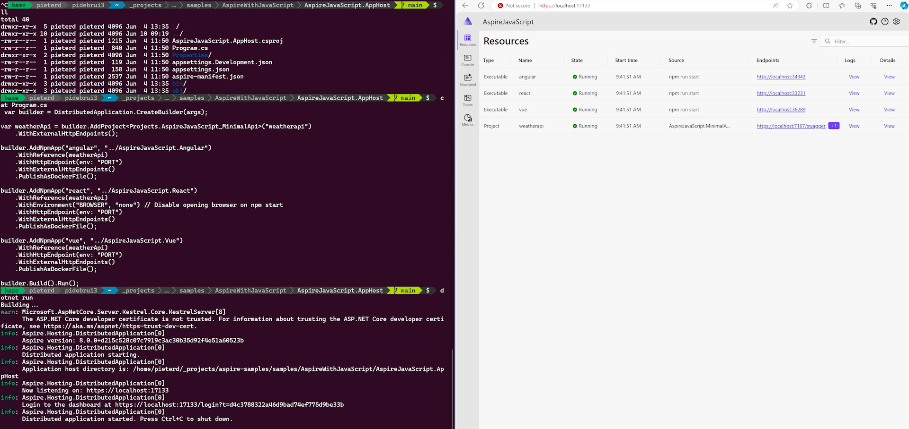

As you know, I love how Microsoft Azure has changed my work from competition between languages and products to freedom of choice. No more: my language is better than yours, or my database, or my message broker. With that, I also try to focus on language independent topics, with exceptions like this one:

Last week [.NET Aspire](https://devblogs.microsoft.com/dotnet/dotnet-aspire-general-availability/) was released to general availability. In itself it is just another release of another component. When you think of the journey of .NET over the past 20 years, this shows very exciting adaptability. 

Remember, .NET was created in a time when it was competing with other languages, both older from Microsoft as well as others, mostly Java. And it only ran on Windows. And it needed a big installation with Visual Studio. And so on. Since then, .NET has been made smaller with .NET Core, it runs on various operating systems, and in containers, with minimal APIs, and native ahead-of-time (=small) compilation.

Aspire aims to make it easier to develop and troubleshoot apps. The first thing you notice is the apphost project that includes the related projects and services of your app. This makes working with multiple projects easier, since the startup behaviour of the solution is described in code. Second you notice that there is a dashboard, which lists those dependencies with endpoints, logs, and details, their console output, structured logs, traces, and metrics. I really like the samples which includes adding dotnet aspire to multiple javascript projects, which shows that is adds value to non-dotnet languages too. 

[Samples](https://github.com/dotnet/aspire-samples)

For a longer explanation, check out the [Build video](https://build.microsoft.com/en-US/sessions/1879189b-070b-4dfa-8c3b-8681e5442863).

[Learn documentation](https://learn.microsoft.com/dotnet/aspire/get-started/aspire-overview)

Thanks for reading! :-)
