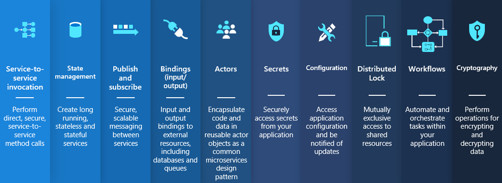

Dapr is a distributed application runtime that helps manage common challenges in development. Simply put: every app has state it needs to store, and services it needs to call. And once you have developed a solution that does this securely, reliably, and configurable, you want to reuse that framework in your next application. This is what Dapr does, and in multiple development languages too, including java, javascript, python, go, .net, etc. 

Dapr has been around since 2019, originally from the Azure incubations team, and donated to CNCF in 2021. The project has grown quite a community with active users and contributors, and is now flirting with graduation, the next maturity level. 

If you haven't tried out Dapr yourself, now is a great time to do so. I think the quickstarts are a great place to start. 

[Quickstarts](https://github.com/dapr/quickstarts/)

[Documentation](https://docs.dapr.io/)

Both these and others live in the Dapr organization on GitHub, so it is all open to use and improve: If you want to contribute but feel a bit unclear where to start, reach out to the maintainers, who are a great set of people. 

If you want to watch a variety of recordings first, check out the playlists on [YouTube](https://www.youtube.com/@DaprDev/playlists).

After burner: Wondering how dapr compares to .NET Aspire that I mentioned previously? Read [Marc's post](https://www.diagrid.io/blog/net-aspire-dapr-what-are-they-and-how-they-complement-each-other)

Thanks for reading! :-)
