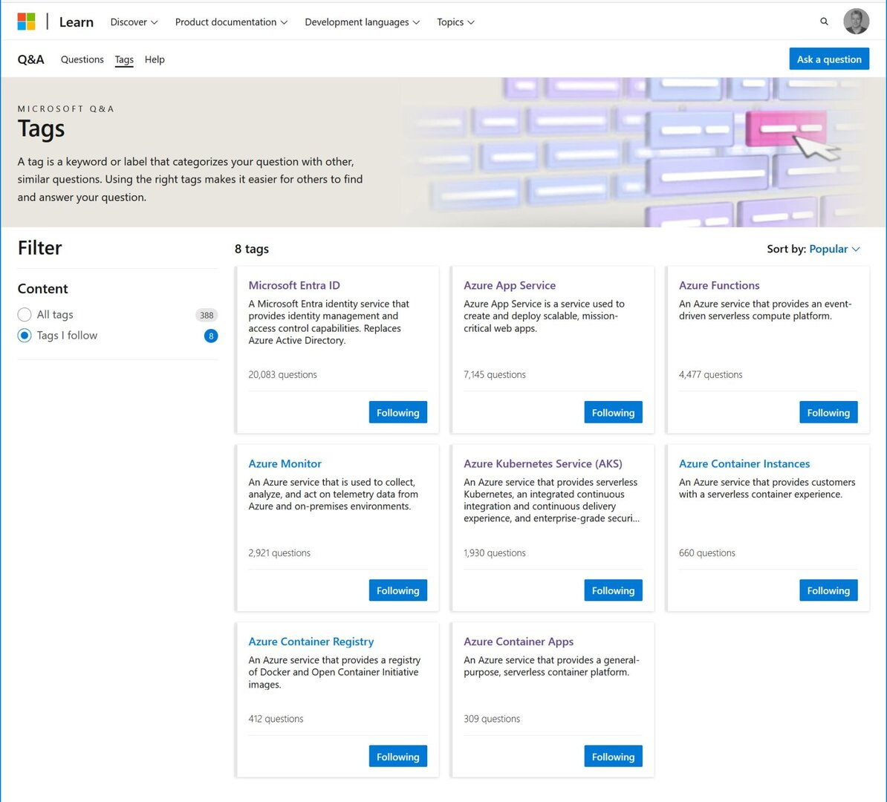

❓ Do you have a question about Microsoft technologies but afraid to ask? 

🗣️ Or do you have experience and want to share with others? 

Check out [Microsoft Q&A](https://learn.microsoft.com/answers/tags/?orderby=name&wt.mc_id=pdebruin_content_blog_cnl_csasci)

🙂 Anyone can ask a question and get support from the community. And once you are there, chances are that you can answer a few questions too. I just did that and it feels very addictive

🏆 Answer a question per week and become considered for the [Community Champions program](https://learn.microsoft.com/answers/support/community-champions-program?wt.mc_id=pdebruin_content_blog_cnl_csasci)

👑 And this could be your step towards becoming [Most Valuable Professional](https://mvp.microsoft.com/mvp/overview?wt.mc_id=pdebruin_content_blog_cnl_csasci)

Thanks for reading! :-)
