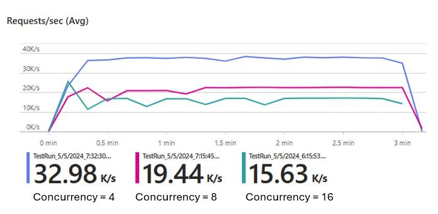

Two interesting blog posts on Azure Functions performance and scale:
🏎️ From 0 to 32000 requests per second in [7 seconds](https://techcommunity.microsoft.com/t5/apps-on-azure-blog/how-to-achieve-high-http-scale-with-azure-functions-flex/ba-p/4169736) and

🔥 Improving [cold start time](https://techcommunity.microsoft.com/t5/apps-on-azure-blog/our-latest-work-to-improve-azure-functions-cold-starts/ba-p/4164500)

Thanks for reading! :-)
