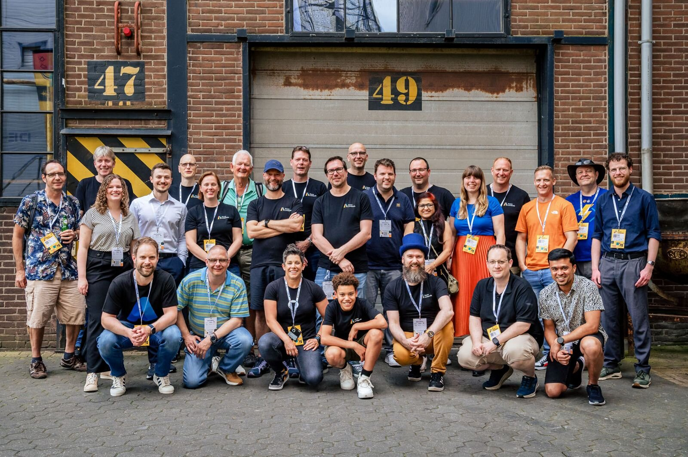

Recently I was able to meet real people at events: AI Community Day, Experts Live, and Azure Lowlands. These events cost money to attend, but you can get in for free when you are a presenteer or a volunteer, which I was. These also happened close to my home, so I could even travel by race bike! 

Even if you are a bit of an introvert, working from home all the time maybe a bit too much. Volunteering at events, or attending free events like meetups, are a great way to meet peers, friends, colleagues/partners/customers. This may sound soft to you, and if you want you can make as much about work as you want. I met lots of people, learned what they do, shared what I do at Microsoft Learn, and how we can make things better. This feedback loop is very valuable. I created custom stickers to advertise my current project with [Q&A](https://aka.ms/learnqna). I spoke with people who are trying to become MVP. Etc. (Note that you can also reach out to me to have these conversations online)

Let's see if I can work at a bigger international event in the next year... 

Thanks for reading! :-)
