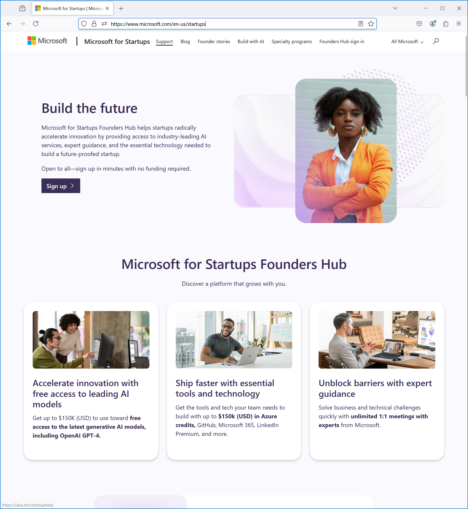

During my work with customers everyday, I have met various types and sizes of organizations. Sure, this would vary depending on the organization or department I was working for. Now in Microsoft Learn, I also see that: Azure is a platform that can run your infrastructure and your apps, regardless what your organization looks like. For instance, you can deploy [enterprise-scale landing zones](https://learn.microsoft.com/azure/cloud-adoption-framework/ready/landing-zone/) but you can also run many things for [free](https://azure.microsoft.com/pricing/free-services/). You can [start there](
https://azure.microsoft.com/pricing/purchase-options/azure-account) today.

Next, you may have access to Azure directly through a personal subscription as a Microsoft most valuable professional (MVP), Microsoft certified trainer (MCT), Visual Studio license or other benefit. This can give you Azure credits, in the sense that you can turn on paid services to that amount like $150. While this doesn't give you a Kubernetes or AI GPU cluster, you can try a large number of services for a couple of hours to experiment. 

Lastly, if you just want to try out Azure to see if it works for you, you can create a trial subscription. This gives you a one-time $200 for a month to experiment. After you have requested this once for your email address, you can still create a regular pay-as-you-go subscription.

I will guide you through that process [here](../startup-azure-free-trial/). 

When you have evaluated Azure, and you have decided it is a match with your startup, check out [Founders Hub](https://www.microsoft.com/startups).

For completeness, I do want to mention that when you start to use more Azure services, you should: 
* closely [monitor your cost](../cost-management/) and
* contact Microsoft to get custom pricing

Thanks for reading! :-)
