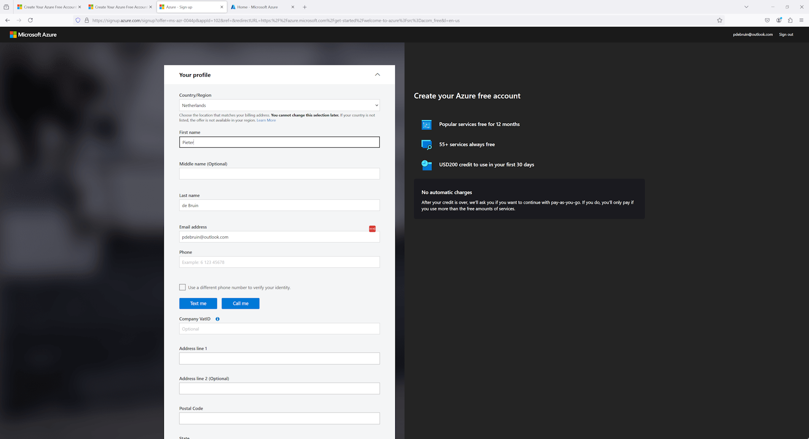
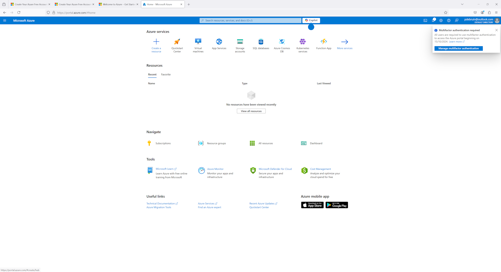

I like to experiment with technology. Recently I was wondering what it looks like to start to use Azure as a new customer nowadays. In another post I explained a bit about various ways to get started. This post describes my experience to start an Azure free trial.

For this, I am using an outlook account that I have created previously but haven't used in the context of Azure. So I can use it to start a one-off Azure trial. Create your new Microsoft account [here](https://account.microsoft.com).

Click on the Try Azure for free link [here](https://azure.microsoft.com/pricing/purchase-options/azure-account).

Sign in with your Microsoft account. 

Fill out profile details. Note that for serious usage, you want to get the country and company vat id right.

Next your credit card information will be used for identity verification. As it says on the page, you won't be charged unless you move to pay-as-you-go pricing. 

The final step is a warning about multi-factor authentication. As you know, MFA helps protect your account beyond an email and password that hackers can guess. If you don't have MFA enabled, please do so. Especially for this account, which is now subscription administator, but really for any account you care about.

The below is optional. There are many things to do in your new subscription. Find a tutorial for the things you care about. If you don't have another plan, check out the [next post about Entra](./startup-microsoft-entra/) to learn more about identity and access management.

Now you can create an Azure resource, such as an Azure Function. 

In the Azure portal, click create a resource.

Find the function app icon, or another service, and click create.

Go through the steps of the wizard, and click review + create. 

Wait for the resource to be created. 

Thanks for reading! :-)
