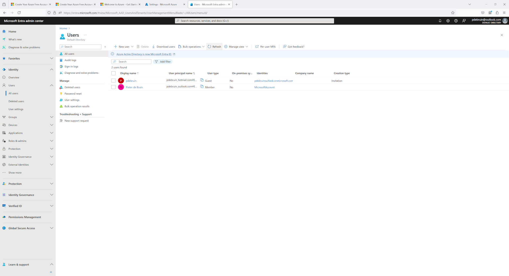

In previous posts I described ways to get started with Azure, and walked through the steps required to create an Azure subscription. Since identity is considered to be the new control plane, let's start with what that looks like in Azure. 

[Microsoft Entra](https://entra.microsoft.com) is the identity service for Azure, and for other cloud services like [Microsoft 365](https://www.microsoft365.com/). Entra also provides much more, but identity management is the most important now that you have an Azure subscription. 

There are a couple of things you want to take care of:
* Create another global administrator
* Enable multi-factor authentication
* Create regular user accounts, or integrate with an existing user store 

Thanks for reading! :-)
