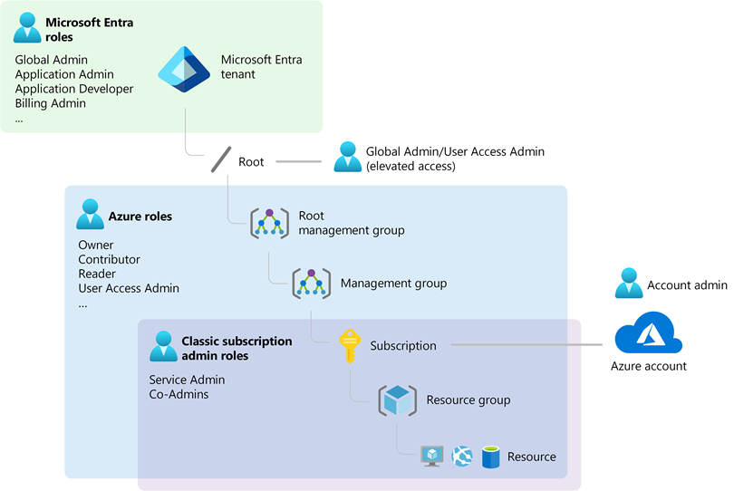

When you are new to a technology, vendor or ecosystem, you may find that others talk about concepts, which may be common to them but alien to you. Tenants and subscription may feel like those. Tenant? I don't rent anything. And subcription? Another streaming service? :-)

If you are new to Azure, please check out previous posts in the startup series, where I describe subscription options, take you through the process of creating a subscription, and getting started with identities. 

Once you go through that journey, you realize that your user store should be set up once, whereas there can be lots of reasons to have more than one subscriptions. So when you start with Azure, you create an Azure subscription, which does cost anything yet until you activate paid Azure services. At that point you don't create an Entra ID tenant, but you get one implicitly. And when you create additional subscriptions, they are normally automatically connected to that same tenant. 

[Image source](https://techcommunity.microsoft.com/t5/startups-at-microsoft/demystifying-microsoft-entra-id-tenants-and-azure-subscriptions/ba-p/4155261)

Obviously there are special scenarios: For instance when you want separate user stores, because you do development against Entra. Then you can create additional Entra tenants in the entra portal. 

As may you have seen, or not, the Entra ID tenant has a *.onmicrosoft.com-name. If you care about what that name is, you can create a second tenant once. Note that the name has to be globally unique and may already be taken. A pro tip to get started with the right tenant name from the start, is to create a Microsoft 365 trial first, which let's you define a username and domain name in the signup wizard. 

Thanks for reading! :-)
