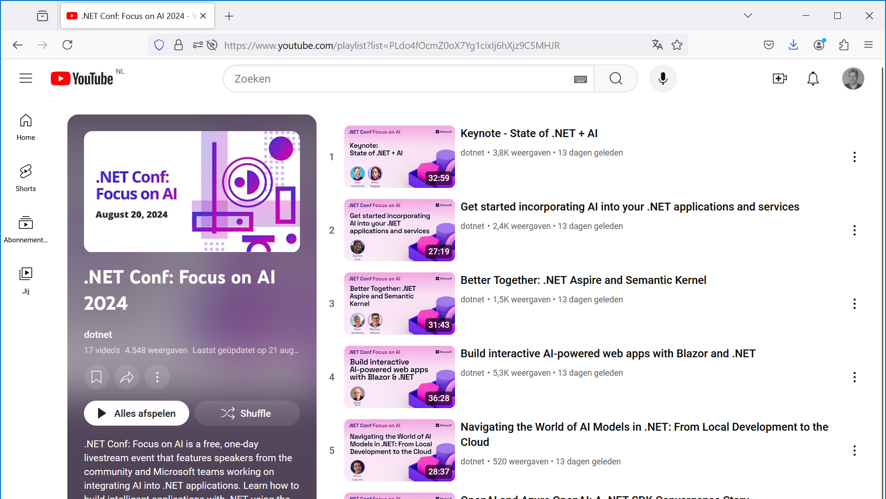

The recording of dotnetconf with a focus on AI is here: 8 hours of in-depth content on a variety of .NET solutions with artificial intelligence. 

[YouTube playlist](https://www.youtube.com/playlist?list=PLdo4fOcmZ0oX7Yg1cixIj6hXjz9C5MHJR) with videos per session 

[Slides repo](https://github.com/dotnetConf/FocusOnAI_24)

[Learn collection](https://learn.microsoft.com/collections/egmeinoxwm4mpy)

Full agenda:
State of .NET + AI - Scott Hanselman, Maria Naggaga 
Get started incorporating AI into your .NET applications and services - Stephen Toub 
Better Together: .NET Aspire and Semantic Kernel - Steve Sanderson, Matthew Bolanos 
Build interactive AI-powered web apps with Blazor and .NET - Daniel Roth From Local Development to the Cloud: Navigating the World of AI Models in .NET - Bruno Capuano 
OpenAI and Azure OpenAI: A .NET SDK Convergence Story - Matthew Soucoup, Roger Pincombe 
Agents: Patterns and Practices for Automating Business Workflows - Kosta Petan, XiaoYun Zhang 
RAG on your data with .NET, AI and Azure SQL - Davide Mauri 
Building Generative AI apps with your data in Azure Cosmos DB - James Codella, PhD 
Milvus Vector Database: Integrating Semantic Search Capabilities with .NET and Azure: Timothy Spann 
Lessons Learned from applying Generative AI to apps with .NET and Azure - Vin Kamat, H&R Block 
Add generative AI capabilities to your .NET Web app for Azure App Service - Gaurav Seth 
Observing AI applications from Dev to Production with .NET Aspire - Anthony Shaw 
Infuse AI in your Windows apps with Windows Copilot Runtime and .NET - Nikola Metulev 
Build your own copilot with Teams AI library and .NET - Ayça Baş, John Miller RAG with AI Search and .NET - Matt Gotteiner

https://focus.dotnetconf.net/

Thanks for reading! :-)
