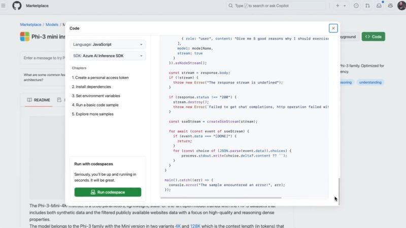

GitHub Models in public preview: Every developer can now become an AI developer with AI models in GitHub Marketplace integrated with Code 🎉

[Blog post](https://github.blog/news-insights/product-news/introducing-github-models/)

[Video](https://www.youtube.com/watch?v=WiBB8Lsgl7I)

Thanks for reading! :-)
