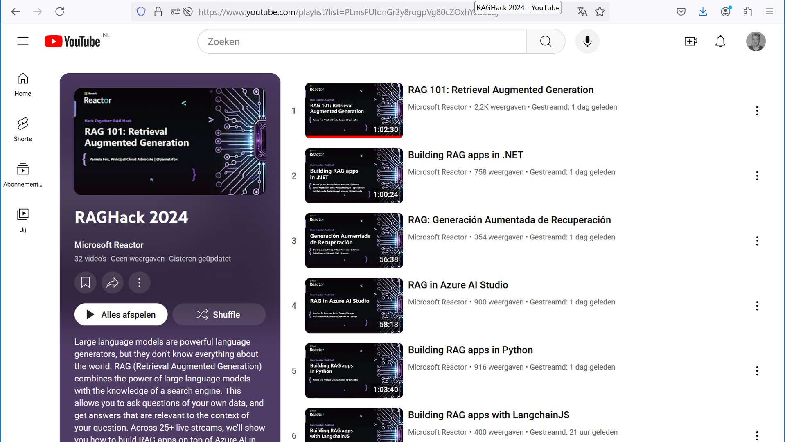

Retrieval Augmented Generation Hackathonstarts on September 3. Repo with more info, stream schedule, samples, registration: https://aka.ms/raghack 

Large language models are powerful language generators, but they don't know everything about the world. RAG combines the power of large language models with the knowledge of a search engine. This allows you to ask questions of your own data, and get answers that are relevant to the context of your question. LLM AI

[YouTube playlists](https://www.youtube.com/playlist?list=PLmsFUfdnGr3y8rogpVg80cZOxhYeuoS2j)

Thanks for reading! :-)
