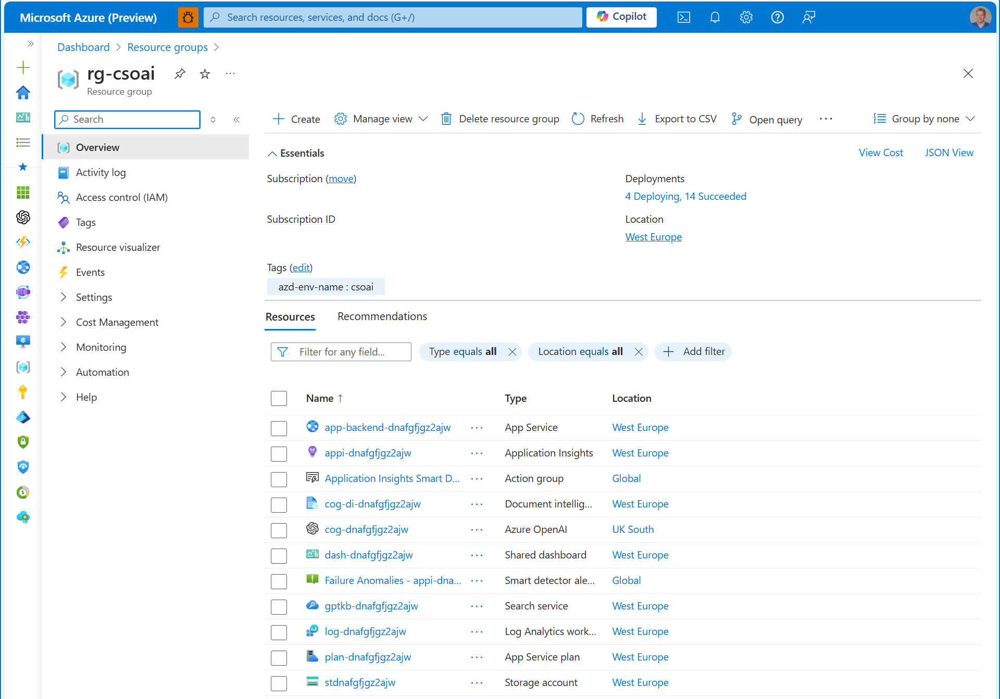
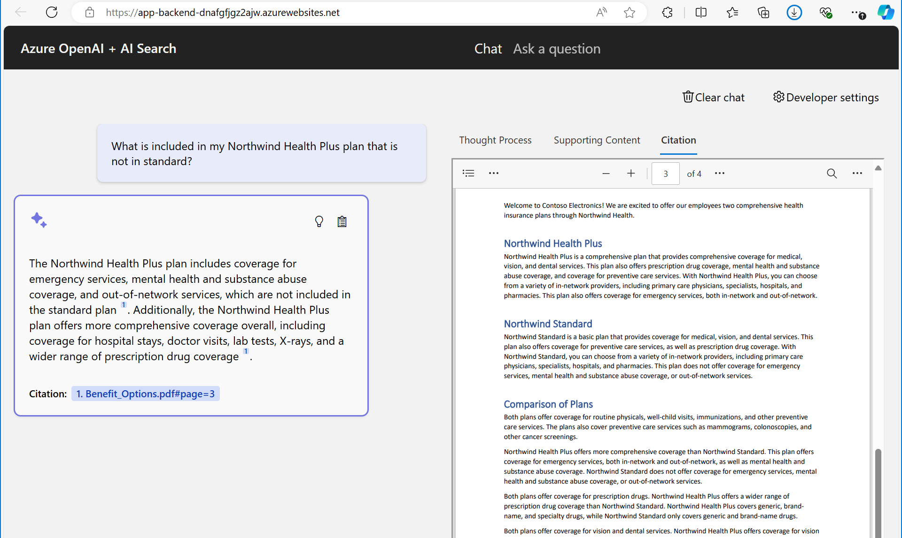

Starting from scratch can be daunting. I prefer to reuse a sample of some sort and then customize to my needs. This means you may have a bit of a learning curve to understand both the sample as well as the technology it uses. This post should help.

The sample: [Azure Search OpenAI demo](https://github.com/Azure-Samples/azure-search-openai-demo)

I wanted to write about this sample for some time, because it includes a number of things that I find fascinating in the new reality with artificial intelligence everywhere: It uses both [Azure OpenAI service](https://learn.microsoft.com/azure/ai-services/openai/overview), Azure's flavor of OpenAI's language models, as well as [Azure AI Search](https://learn.microsoft.com/azure/search/search-what-is-azure-search), which has been around longer. It also provides scenario data from Contoso Electronics, which demonstrates how you can make the sample work with your data. Lastly, the sample is very thorough in the sense that it contains bicep scripts to provision Azure services through [Azure Developer cli AZD](../azd-cli/), source code for the apps, documentation for various scenarios, and tests. 

Since the sample is rather thorough, it has quite a number of dependencies. To get started without worrying about those, you should use GitHub Codespaces if you can. Deploying the app is done through ``` azd up ```.

This will additionally result in an [Azure app service](https://learn.microsoft.com/azure/app-service/overview) that hosts the app, an [Azure storage account](https://learn.microsoft.com/azure/storage/blobs/storage-blobs-overview) to store the scenario pdf files, and [Azure AI Document Intelligence service](https://learn.microsoft.com/azure/ai-services/document-intelligence/overview) to analyze them. 



Once the deployment is finished, you can access the app through the url of the app-backend. You can then interact with the solution, for instance by asking it about health plans. Finally the chat response contains citations, which you can click on to see the source pdf file. 



In following posts, let's look at those Azure services to understand what they do and whether you need them in your app. 

Thanks for reading! :-)
