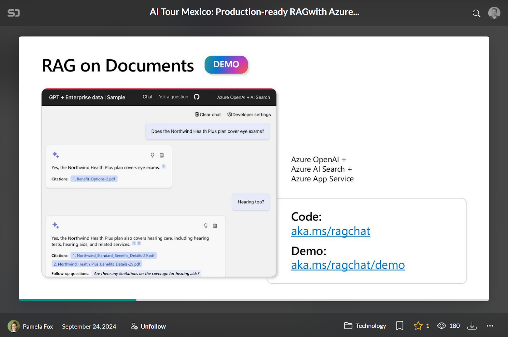

The planned explaining posts of the RAG sample may have to wait, since other things are happening :-) 

First, Pamela Fox, who created the sample, presented at the AI Tour in Mexico. Check out the [slides](https://speakerdeck.com/pamelafox/ai-tour-mexico-production-ready-rag-with-azure-ai-search).

Next, she presented the same topic in a [live stream](https://www.youtube.com/watch?v=ys9CYtqP2Ow).

For completeness, check out the [sample](https://github.com/Azure-Samples/azure-search-openai-demo/).

And a [live demo](https://capps-backend-g6kuptydvtma6.redocean-cd0fb0be.westus.azurecontainerapps.io/). 

Thanks for reading! :-)
