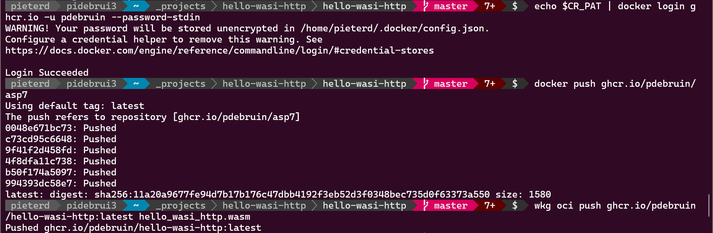

Distribute webassembly components using OCI registries! 🎉 See this blog post about creating a webassembly component in Rust and pushing it to GitHub Packages (aka GitHub Container Registry)

[Blog post](https://opensource.microsoft.com/blog/2024/09/25/distributing-webassembly-components-using-oci-registries/)

Thanks for reading! :-)
