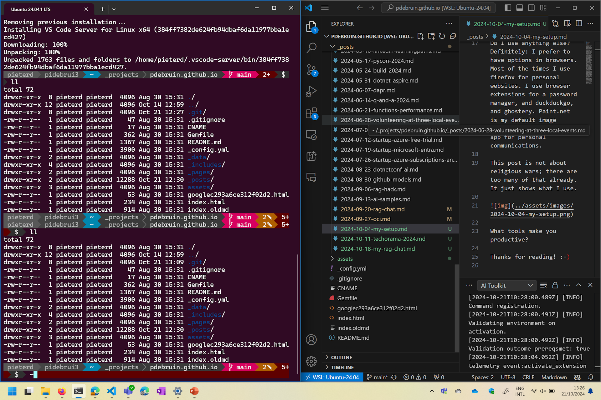

I am a big fan of open source and cross-platform. And I also work for a company that build Windows and cares about security. So what tools do I use to get stuff done?

My Surface Laptop Studio is a great device. It runs Windows. It can also dual boot into Ubuntu, which I use occasionally. I do use Linux daily, on Windows, in Windows Subsystem for Linux, through Windows Terminal. 

Windows and Edge browser, signed in with work profile, is the easiest way for me to access internal systems. I have https://outlook.office.com/ open all day, as well as the Teams app. I use Word, Excel, Powerpoint, both through the browser and through their apps. Work files are synchronized to onedrive business, private files to onedrive personal. And I use OneNote for meeting notes. 

When Microsoft launched WSL, with remote VS Code, and later Windows Terminal, it became a lot easier to quickly test solutions on Windows and Linux. Actually, my default with anything VS Code, including code, scripts, and content, is to create it in WSL. With a pretty prompt.

Do I use anything else? Definitely: I prefer to have options in browsers. Most of the times I use firefox for personal websites. I use browser extensions for a password manager, and duckduckgo, and ghostery. Paint.net is my default image editor. And the whatsapp app for personal communications. 

This post is not about religious wars; there are too many of that already. It just shows what I use. 

What tools make you productive?

Thanks for reading! :-)
