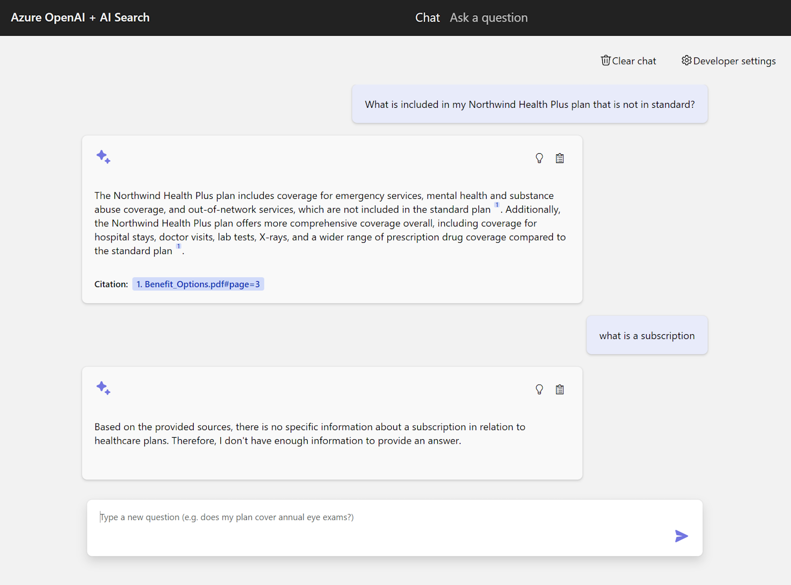
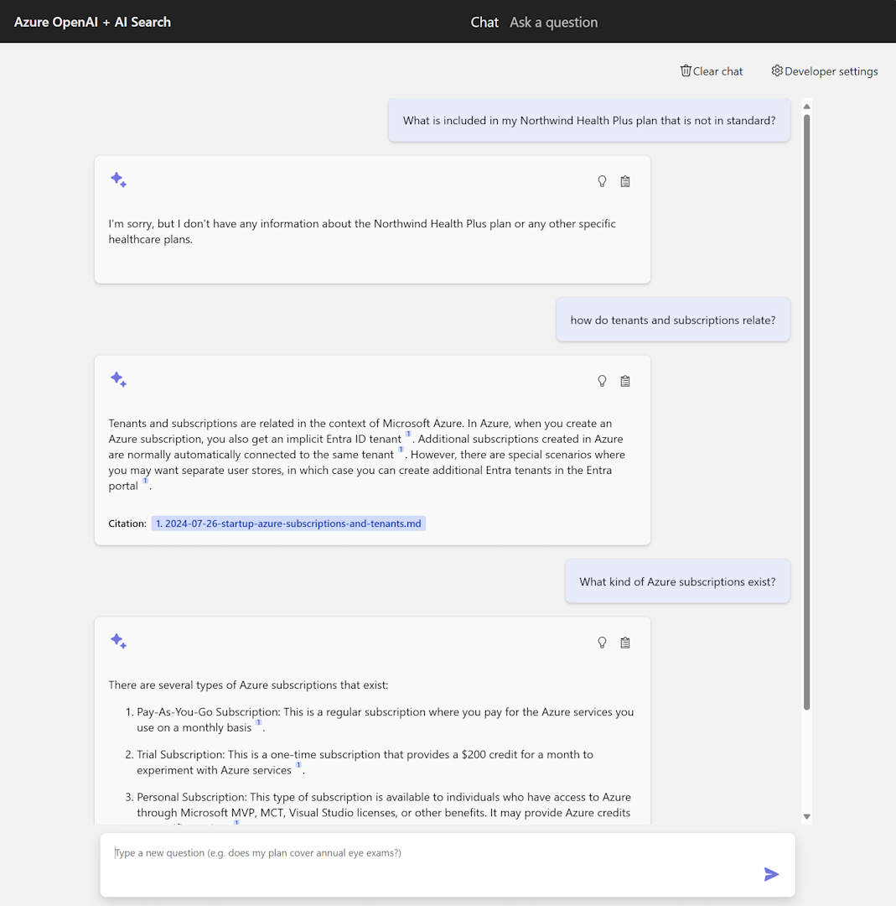

As first step to experiment with the [RAG chat sample](https://github.com/Azure-Samples/azure-search-openai-demo), I adopted it to forget the sample data and learn about my own blog posts instead. The sample shows a question about northwind health plans and nothing else. 

My blog doesn't cover anything of northwind health plans :-) and so I provided posts about Azure and subscriptions. 

Look at that! I am impressed. It knows my stuff, I can ask a question and get a proper answer. How did that work?

The initial deployment I did using GitHub Codespaces. I tried to deploy from a local environment but that didn't work straightaway and codespaces did. Maybe I will debug that later. When you follow the deployment instructions, you will play with AZure Developer command-line interface (AZD). The sample contains a data folder with the sample data. I deleted those pdf files, added a few markdown files from my blog, deployed again, and it worked. 

When you investigate what happens during deployment, you will see prepdocs scripts that do some magic. Since that may look a bit intimidating, I thought it would be interesting to build something new using these same services including search, document intelligence, and openai. See future post. 

Thanks for reading! :-)
