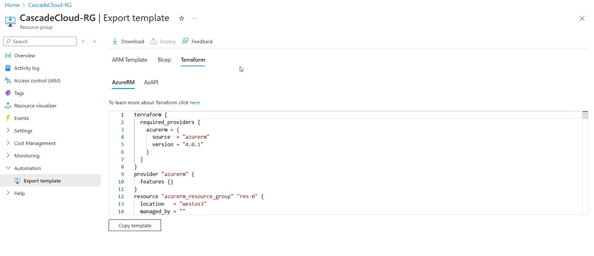

The Azure Portal has new functionality in preview to export resource templates in terraform and bicep, next to Azure resource manager. This is a great addition to help in devops scenarios. 

Let's start at the beginning: The Azure portal is great to experiment with creating and configuring Azure services. However, once you are going down the road of using them in development, test, qa and production environments, you want to automate the deployment and store those scripts and automations in version control. 

Suppose you have created resource groups and resources in Azure through the portal and now want to start automating it. That is where this new functionality comes in, especially if your organization standarizes on terraform which supports other clouds, or bicep which is a more accessible form of ARM. Use whatever tool works for you. 

[Documentation](https://learn.microsoft.com/azure/developer/terraform/azure-terraform-resource-provider/resource-provider-overview?wt.mc_id=pdebruin_content_blog_cnl_csasci)

Thanks for reading! :-)
