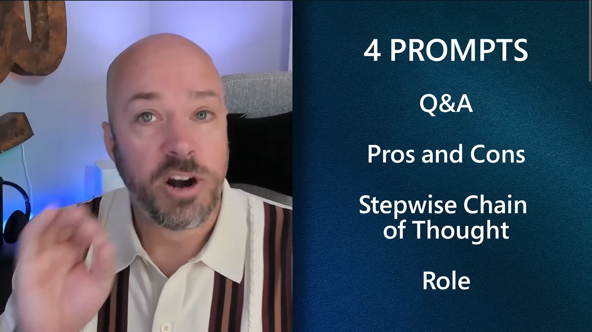

While I was at the AI tour in Berlin last week, I noticed that hearing other people's experience with copilots help me think out of the box and make me try more. So I thought it might make sense to share a number of ideas to get you started: some you may already know, some maybe less relevant, but if only one helps you become more productive today then it is worth it for me to write this and for you to read. 

[4 GitHub Copilot prompts every developer should know](https://www.youtube.com/watch?v=H3M95i4iS5c)

[6 must-try features for GitHub Copilot for Azure](https://www.youtube.com/watch?v=OEJwzsWnLog&list=PLlrxD0HtieHgdwrN6ooxApdfBKTJK7465)

Thanks for reading! :-)
