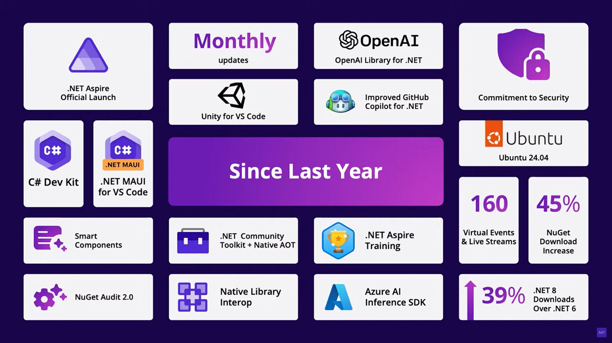

For years, I was fine developing software in .NET, because I knew it, its ecosystem, and I could get things done. When I got more involved in Azure, I realized a challenge of .NET was at the time it only ran on Windows which limited its potential. Luckily .NET became cross platform with dotnet core, and now it runs on Linux and in containers. And it is continuously evolving with focus on AI, cloud-native, and performance and security. Really lots of things to be happy with. Read more in an [earlier post](../dotnet-appreciation/).

Ok, so dotnetconf happened this week. What was it all about:

* [dotnet 9 is here](https://devblogs.microsoft.com/dotnet/announcing-dotnet-9/?wt.mc_id=pdebruin_content_blog_cnl_csasci). More features, and faster. Note that dotnet 8 is LTS, so only migrate to 9 if you need its functionality. 

* dotnet aspire is getting mature. Aspire was released only [half a year ago](../dotnet-aspire/) and the team continuous to expand it. Most interesting is the [video series](https://www.youtube.com/watch?v=4ixWtXK7KzY) to start learning and using aspire 

* Something AI. Artifical intelligence gets all the attention these days, and there is a specific dotnet [extention for ai and vector data](https://devblogs.microsoft.com/dotnet/introducing-microsoft-extensions-ai-preview/?wt.mc_id=pdebruin_content_blog_cnl_csasci), which provide a unified layer of abstraction for interacting with AI services. 

* No mention, but still relevant: [Chisel and Trim for asp.net container images](https://github.com/pdebruin/asp9) to make them as small as 44 MB(!) 

Thanks for reading! :-)