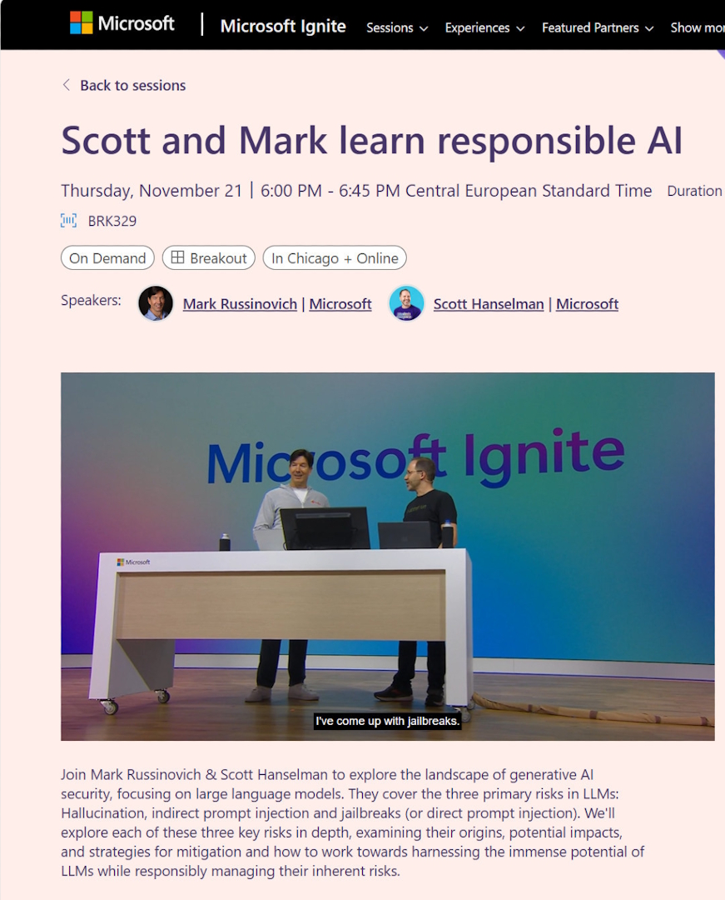

This was Ignite week. It could have been a great reason to visit Chicago, but that will have to happen another day. So I watched it online, and honestly the good thing about online conferences is that you can watch streams live or later for those that are recorded, which were many (439...). 

For those who prefer text, check out the [book of news](https://news.microsoft.com/ignite-2024-book-of-news/?wt.mc_id=pdebruin_content_blog_cnl_csasci) that contains the headlines for product updates that happened around the event. 

If there is one recorded MSIgnite session you want to see, it is this one: [Scott Hanselman and Mark Russinovich learn responsible AI](https://ignite.microsoft.com/sessions/BRK329?wt.mc_id=pdebruin_content_blog_cnl_csasci). Learn about limitations and threats through live demos like jailbraking, promptinjection, reasoning, hallucinating, kindness, and how to prepare for them. 

Sure there was lots of attention for artificial intelligence and security, which are important these days. I was also happy to see attention for open source projects like [keda](https://keda.sh/), [dapr](https://dapr.io/), [copa](https://project-copacetic.github.io/copacetic), [radius](https://radapp.io/), and [drasi](https://drasi.io/).

Here is one way to get hands-on with [workshop materials](https://nitya.github.io/contoso-chat/) from the event and the [original repo](https://github.com/Azure-Samples/contoso-chat).

Thanks for reading! :-)
