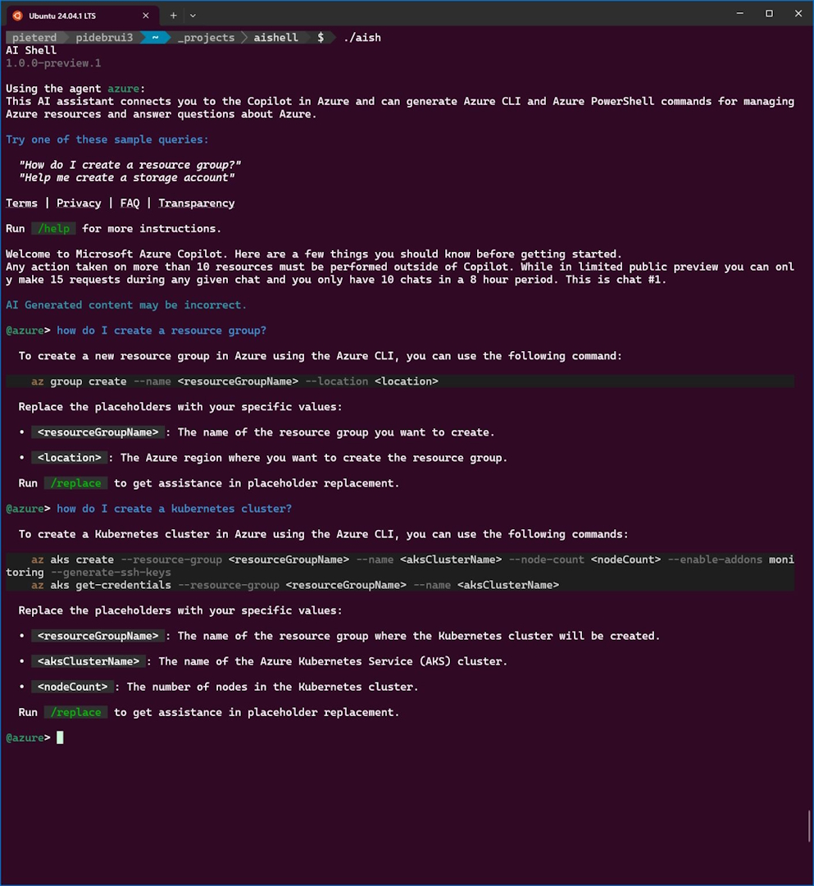

AI Shell, or az copilot, is in public preview.

In the screenshot, you can see that the tools suggests to be able to help with questions like: 

* How do I create a resource group? 

* Help me create a storage account

or my question: How do I create a kubernetes cluster?

[Announcement](https://devblogs.microsoft.com/powershell/announcing-the-public-preview-of-ai-shell/?wt.mc_id=pdebruin_content_blog_cnl_csasci)

[Documentation](https://learn.microsoft.com/powershell/utility-modules/aishell/overview?wt.mc_id=pdebruin_content_blog_cnl_csasci)

[Repository](https://github.com/PowerShell/AIShell)

Thanks for reading! :-)
