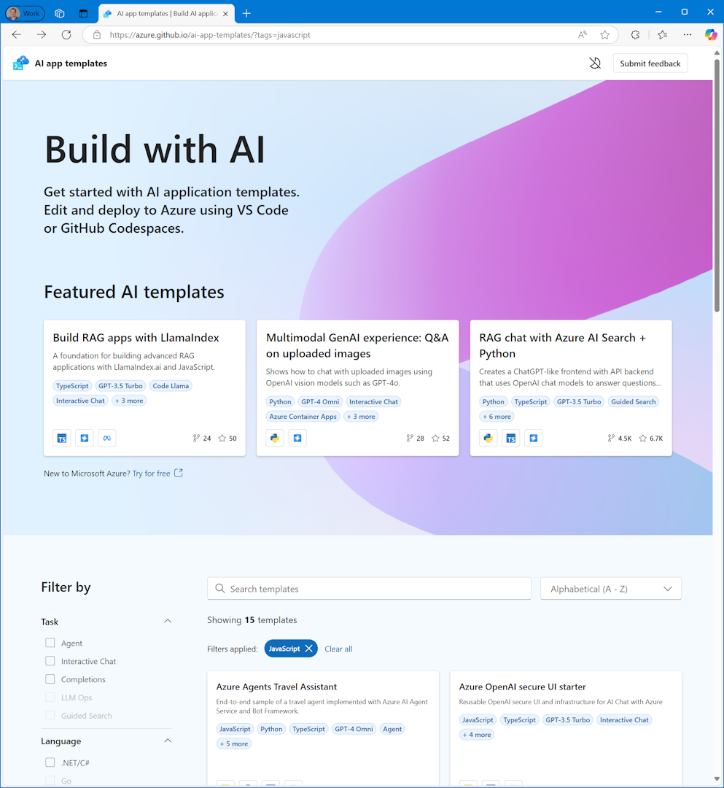

Learning new technologies can be hard and starting new projects with new technologies even harder. I prefer to only start from scratch when I know exactly what I am doing, which is not often :-) To help you start a new AI project, there is a new AI app template gallery. It contains samples, hosted on GitHub, in many languages, 

For instance, there are 27 templates for 'rag chat', so that could be your next project.

[AI app template gallery](https://azure.github.io/ai-app-templates)

[Announcement](https://techcommunity.microsoft.com/blog/educatordeveloperblog/kickstart-your-ai-journey-using-azure-ai-app-templates-to-build-ai-applications/4304620?wt.mc_id=pdebruin_content_blog_cnl_csasci)

Thanks for reading! :-)
