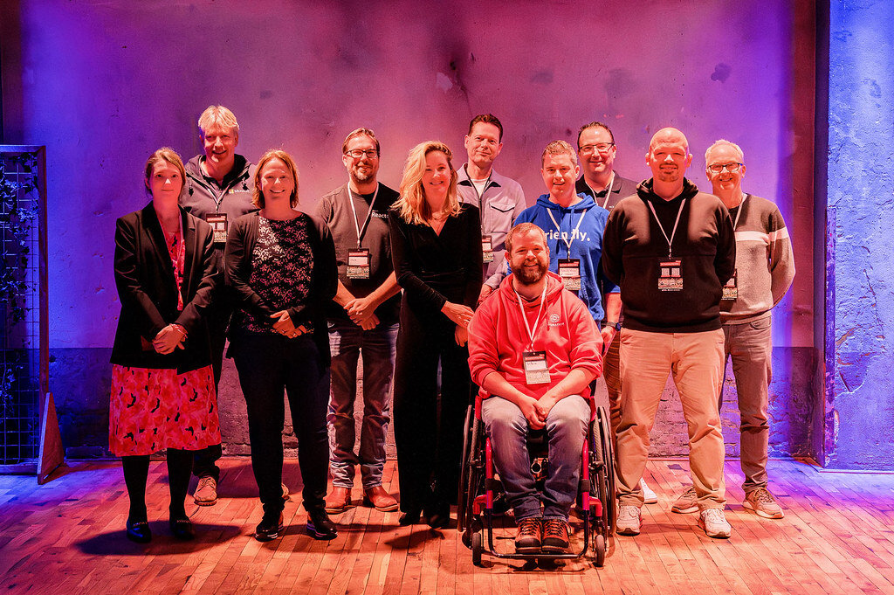

As you may know, I work with team members from across the world. While this is a great experience so far, one of the downsides is that I don't meet people in person a lot. So every now and then, I try to attend events, preferably by volunteering so that I help the event happen. 

The last AI community day in the Netherlands was in June and it was time for another one. The event was in Utrecht, which is close to where I live. 

It was fun to meet old and new friends, run audio/video tests which I hadn't done before, meet Donna Sarkar live, make plans about training minorities, etc. When this sounds like something you want to help with too, reach out to organizers in your area or start a new chapter. 

[globalai.community](https://globalai.community/communities/)

Thanks for reading! :-)
