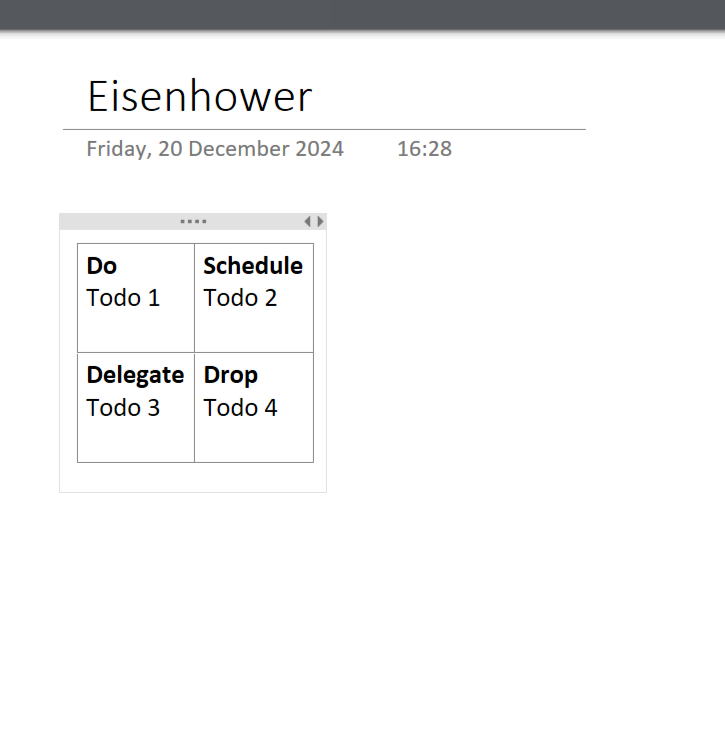

Every now and then I think about what I want to achieve, what I should continue to do and what I should stop, and finally how to turn that into daily work. 

Scott Hanselman has been blogging since forever and has [a number of gems](https://www.hanselman.com/blog/scott-hanselmans-complete-list-of-productivity-tips) which you will find referenced from this blog. 

He also has a very realistic way of [exlaining his approach](
https://www.youtube.com/watch?v=RpH6IPhyh7I).

One of the essential pieces is his interpretation of what [Eisenhower](https://en.wikipedia.org/wiki/Time_management#The_Eisenhower_Method) also seemed to do to manage time: 

* Do (do it yourself now)
* Schedule (do it yourself at a planned datetime)
* Delegate (Ask someone else to do it)
* Eliminate (Do not do it)

They are in a matrix or quadrant, where the first two are important, and the first and third are urgent. If you take away anything, let it be this.

Also since forever I have been following and using the work of JD Meier. His [agile results](https://gettingresults.com/getting-started/) should be mandatory for everyone in technology. 

Actually, mentioning them both in this post makes me see the similarities, which shouldn't be surprised but I just hadn't noticed before. 

Thanks for reading! :-)
