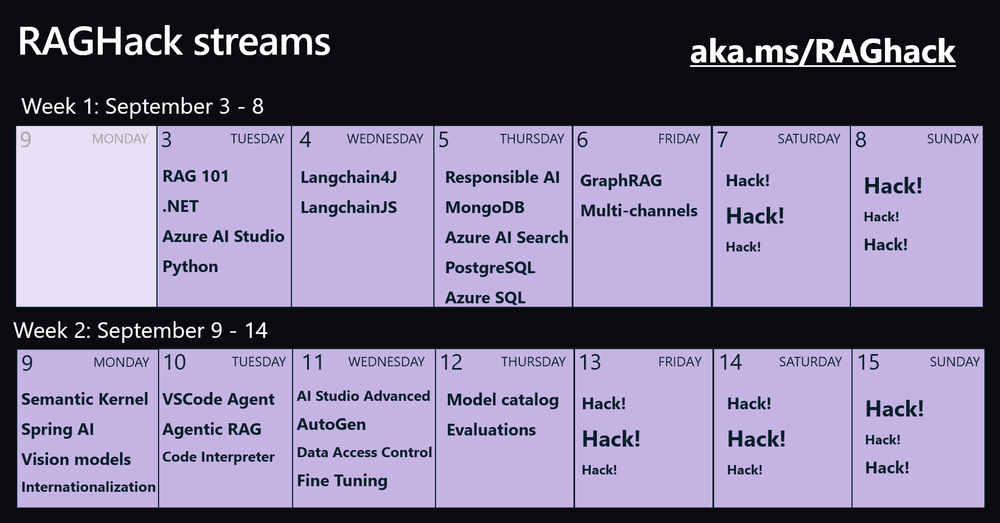

I have mentioned the RAG Chat solution before. This is another hat tip to [Pamela Fox](https://www.pamelafox.org/) who has organized a hackathon in September with video recordings and presentations that are great at explaining the basics and beyond with Langchain, multiple data stores, programming languages, etc. See the list of session in the schedule below and find all the details through the techcommunity post.

[Blog post](https://techcommunity.microsoft.com/blog/azuredevcommunityblog/raghack-2024-recordings-and-slides/4359662?wt.mc_id=pdebruin_content_blog_cnl_csasci)

Thanks for reading! :-)
