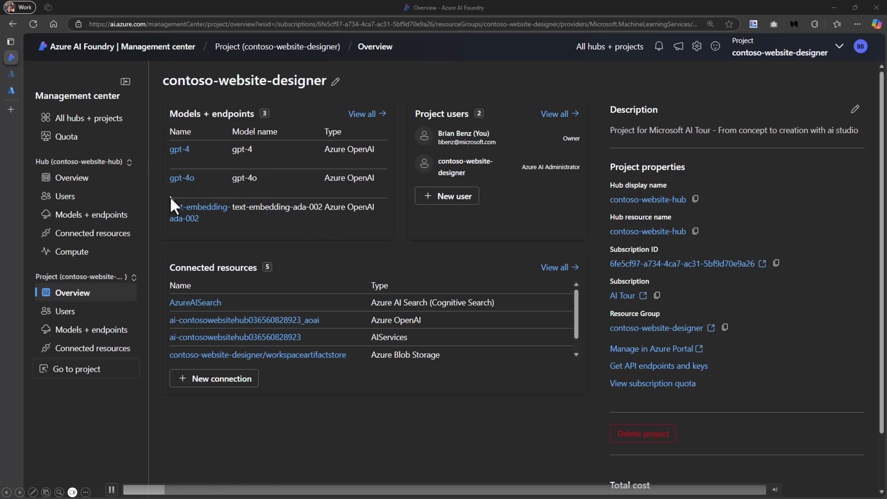

Recently, the AI Tour was in New York City, and I saw a colleague share their presentation and sources. First, this reminded me how great it is to just share your presentation proactively regardless of what the event does. And second, I wanted to investigate this myself. 

They presented on AI Foundry, the service formerly known as AI Studio. The presentation is a large file with videos of demos included. 

[Repository](https://github.com/microsoft/aitour-concept-to-creation-ai-studio)

So now I am off to run this myself, and to share past presentations. 

Thanks for reading! :-)
