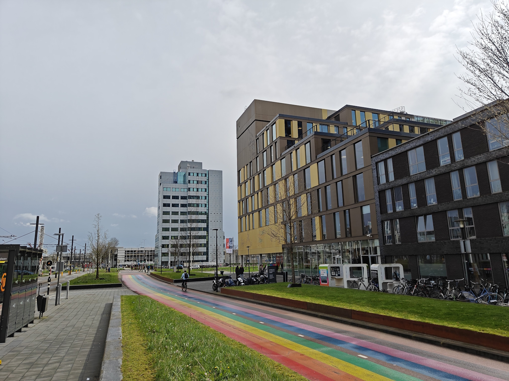

For the past semester since September I have been studying again. Well, actually I think I learn something new everyday, especially while working in technology and in the learning industry. However, this is different. I have completed a premaster, to prepare for a master education. 

25 years ago I completed my bachelor studies, spent a year at a university which didn't work at the time, started working in technology and never looked back. 

Until recently, when I joined the Utrecht university of applied sciences as an industry expert to supervise final presentations of students and how they are evaluated. This is fun to do, and got me in conversations with the university to discuss other options to get involved. 

They described that they want their students to learn from people who have earned a "higher" degree than them, so a bachelor student should be taught or mentored by a master graduate. 

Anyway, this got me thinking, and with all fake news in the world, I got intrigued by the process of doing academic research, which I want to learn more about. One of the confrontations was that the premaster took much more time than I was expecting, often keeping me working until late and in weekends. So I have decided to continue this education, but at a slower pace than regular so that I will increase my chances of actually completing the whole thing. Wish me luck!

Thanks for reading! :-)
