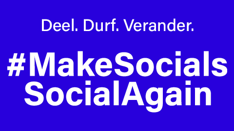

Content warning: This is political. 

International dynamics have changed over the past months, and especially the past weeks. This has made me look at what social platforms I use. 

You may say that I should not talk about this, because I currently work for a big technology company that makes noise about artificial intelligence. If so, reach out to me and I would love to discuss. As a hint, I can share that I am critical about the use of energy, natural resources, and that I worry about democracies and fake news. 

Anyway, I have ended my personal relationships with a number of platforms that I don't want to be associated with anymore. Check out my personal website to see where you can reach me. 

[More info at the campaign site, in Dutch](https://makesocialssocialagain.nl/)

Thanks for reading! :-)
