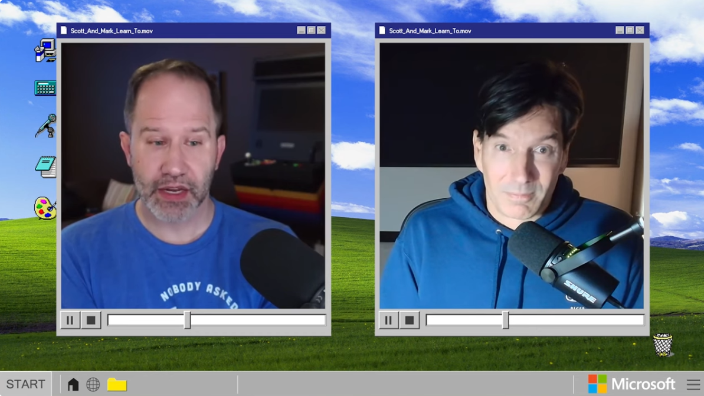

As I was preparing to present at an online conference, Scott & Mark published a video about public speaking. Scott Hanselman and Mark Russinovich are both up in the hierarchy, and present regularly. I always watch their individual presentations, because they are either educational, or entertaining or both. Now, some people together have more chemistry than others, but I think it is great that Scott and Mark are trying, and touch on interesting topics, well except for the skin care episode. And they make try to have fun, which helps. 

So this time they spoke about public speaking. 

Takeaways:
* Who is your audience?
* Present about something you are knowledgeable about
* Consider the stakes
* Prep accordingly
* Demo's, videos, backup machines, etc
* Start with the end in mind, and build a narrative
* And more.

[YouTube video](https://www.youtube.com/watch?v=X2jrg7r4gOY)

Thanks for reading! :-)
