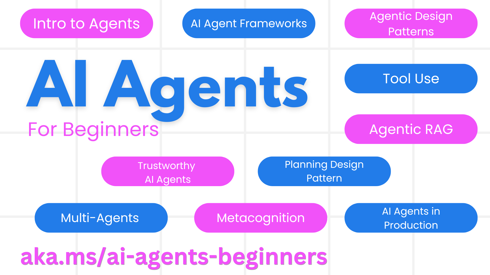

Artificial intelligence is generating lots of excitement, confusion, criticism, etc. For me, the best way to understand it is to learn about it. In that sense, [Learn and AI](https://learn.microsoft.com/ai?wt.mc_id=pdebruin_content_blog_cnl_csasci) is a great place to start. 

If you are specifically looking to get trained in a certain area, the latest trend is about agents, which go beyond retrievel augmented generation and chats, and are going to be able to perform actions. [AI Agents for Beginners](https://github.com/microsoft/ai-agents-for-beginners) is the latest in a series of for beginners courses that everybody should read

There are also other beginners courses:

[Generative AI for Beginners using .NET](https://github.com/microsoft/Generative-AI-for-beginners-dotnet?wt.mc_id=pdebruin_content_blog_cnl_csasci)

[Generative AI for Beginners](https://github.com/microsoft/generative-ai-for-beginners?wt.mc_id=pdebruin_content_blog_cnl_csasci)

[ML for Beginners](https://aka.ms/ml-beginners?wt.mc_id=pdebruin_content_blog_cnl_csasci)

[Data Science for Beginners](https://aka.ms/datascience-beginners?wt.mc_id=pdebruin_content_blog_cnl_csasci)

[AI for Beginners](https://aka.ms/ai-beginners?wt.mc_id=pdebruin_content_blog_cnl_csasci)

[Cybersecurity for Beginners](https://github.com/microsoft/Security-101??wt.mc_id=pdebruin_content_blog_cnl_csasci)

[Web Dev for Beginners](https://aka.ms/webdev-beginners?wt.mc_id=pdebruin_content_blog_cnl_csasci) 

and more...

Thanks for reading! :-)
