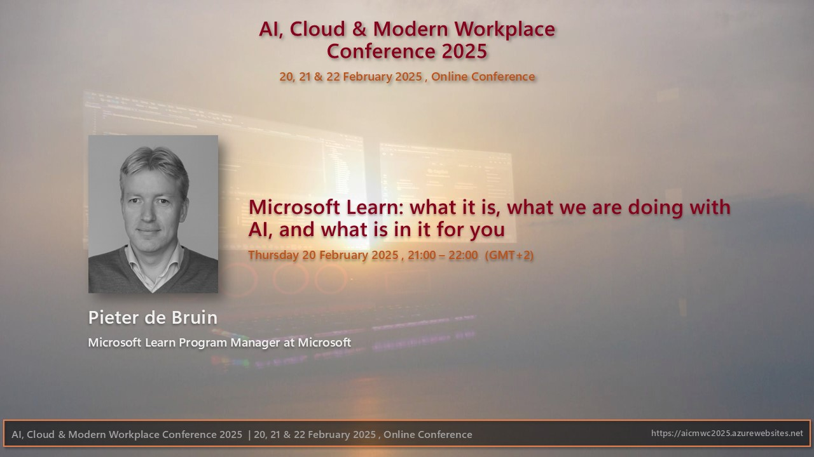

This week I had the [opportunity to present](https://github.com/pdebruin/presentations/tree/main/Greece%20Cloud%20AI%20conference%202025) about [Microsoft Learn](https://learn.microsoft.com), and what we are working on. This is a fun way of structuring thoughts on (digital) paper and sharing ideas with others. 

As always, feedback is a gift, so feel free to share your comments or questions. 

Thanks for reading! :-)
