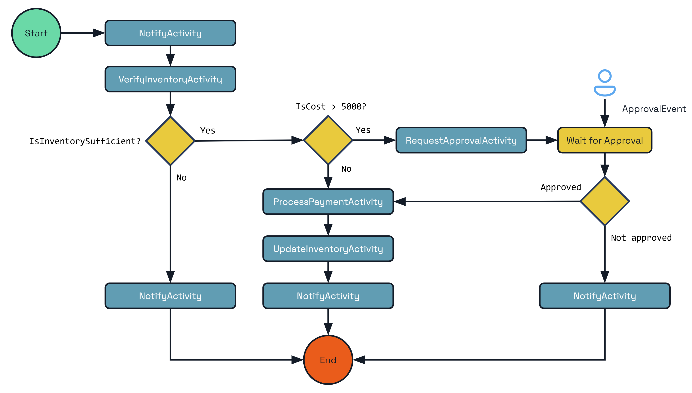

This week [Dapr v1.15](https://blog.dapr.io/posts/2025/02/27/dapr-v1.15-is-now-available/) was released. I wrote about [Dapr](../dapr) before because it is a great framework to help build custom apps in any language which takes care of the plumbing of state, pubsub, etc in a pluggable way. This version brings Dapr Workflow to stable which means that organizations may be interested to use it in real production apps. 

To see what it does, there is a good example that shows a flow of approval, payment and inventory update. This may look like a complicated implementation of relative simple functions, but you should see this as a starting point for your own business processes. 

[Blog post](https://blog.dapr.io/posts/2025/02/27/dapr-v1.15-is-now-available/)

[Workflow docs](https://docs.dapr.io/developing-applications/building-blocks/workflow/workflow-features-concepts/)

Thanks for reading! :-)
