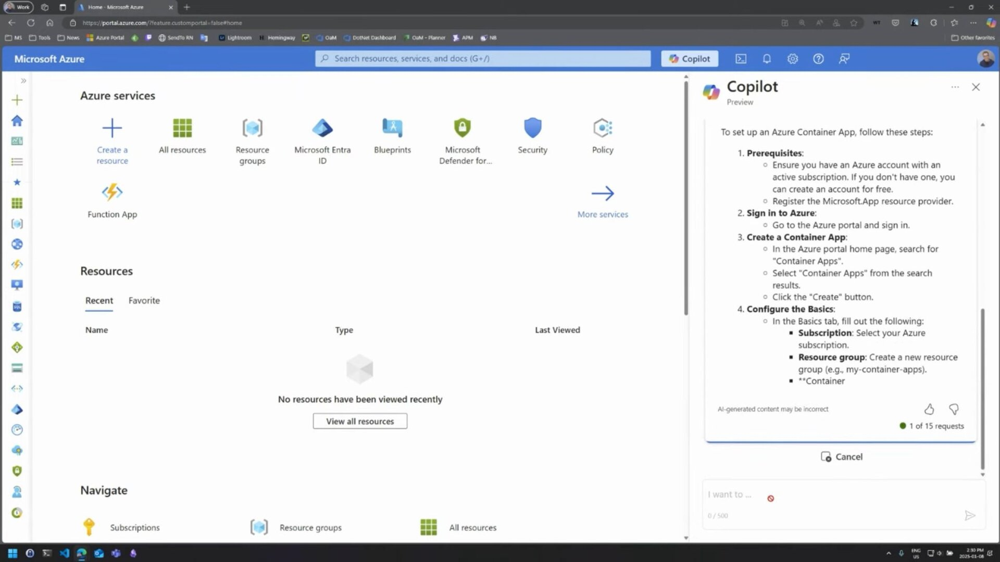

This title is generic, but the blog post and video are actually very specifically about Ask Learn, the chat experience you have may have used through Azure portal copilot, to ask questions about your situation and get them answered through Learn documentation or Q&A answers. 

[Blog post](https://devblogs.microsoft.com/engineering-at-microsoft/ai-in-action-how-to-build-scalable-rag-enabled-ai-apps/)

Slightly related is the announcement of more [small language models](https://azure.microsoft.com/en-us/blog/empowering-innovation-the-next-generation-of-the-phi-family/) which provide a [less resource-intensive option](../phi3-slm/) for AI solutions.

Thanks for reading! :-)
