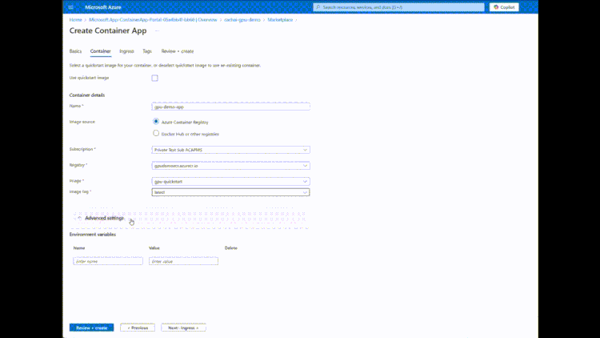

AI workloads can use lots of GPUs, which are expensive, hard to get, and require power and precious metals. 

What if ... you could use GPUs as a service, don't own them, just pay for using them. Well, now you can with Azure Container Apps serverless GPUs 

[Blog post](https://techcommunity.microsoft.com/blog/appsonazureblog/announcing-ga-for-azure-container-apps-serverless-gpus/4394302)

[Docs](https://learn.microsoft.com/en-us/azure/container-apps/gpu-serverless-overview)

Thanks for reading! :-)
