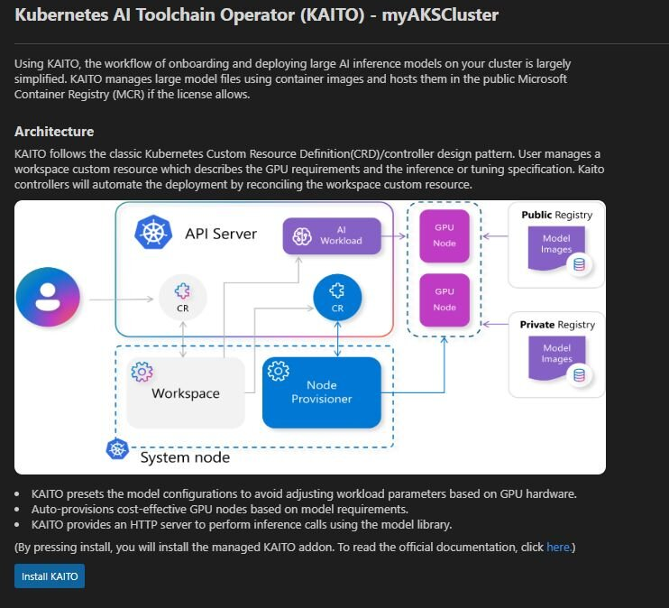

What’s new with Microsoft in open-source and Kubernetes. The blogpost contains an overview of many developments including Hyperlight, Drasi, KubeFleet, SpinKube, RAG in KAITO, and many others.

[Blog post](https://opensource.microsoft.com/blog/2025/04/01/whats-new-with-microsoft-in-open-source-and-kubernetes-at-kubecon-cloudnativecon-europe-2025/)

Thanks for reading! :-)
