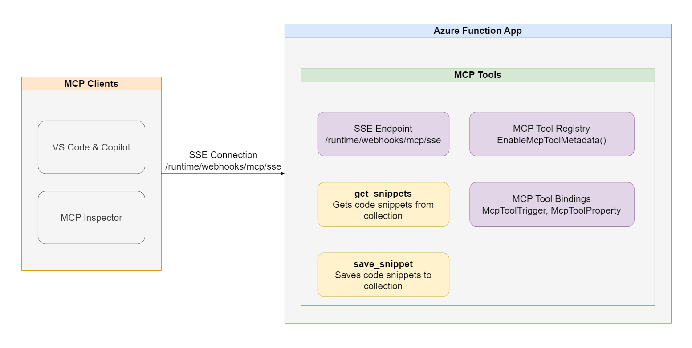

Model Context Protocol (MCP) is a way for apps to provide capabilities and context to a large language model. A key feature of MCP is the ability to define tools that AI agents can leverage to accomplish whatever tasks they’ve been given. MCP servers can be run locally, but remote MCP servers are important for sharing tools that work at cloud scale. 

Remote MCP quickstarts in Python, Node.js (TypeScript), and .NET (C#) are a preview of triggers and bindings that allow you to build tools using remote MCP with server-sent events (SSE) with Azure Functions.

[Blog post](https://techcommunity.microsoft.com/blog/appsonazureblog/build-ai-agent-tools-using-remote-mcp-with-azure-functions/4401059)

[Repo](https://github.com/Azure-Samples/remote-mcp-functions)

Thanks for reading! :-)
