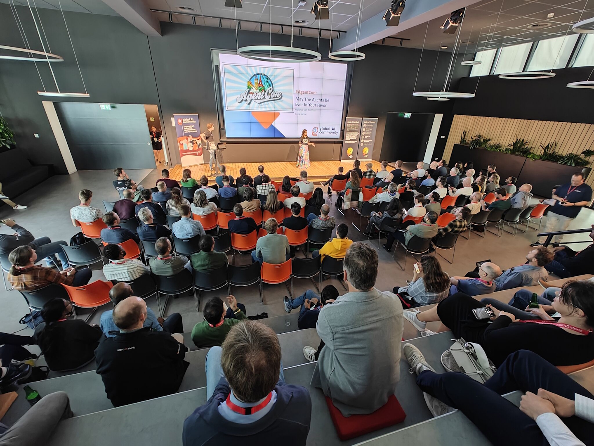

Did you miss Global AI Community AgentCon at SopraSteria in Utrecht? Check out the recording of the main stage:

* A developers introduction to Copilot Studio
* Secure by design
* AI developer odyssey
* Keynote
* Taking agents everywhere with Semantic Kernel
* AI infrastructure

[Recording](https://www.youtube.com/watch?v=BHvnK_08uGo)

Thanks for reading! :-)
