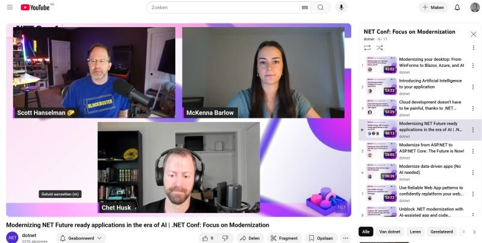

DotNetConf with a focus on modernizataion happened on April 22 and recordings are available now. Learn about AI, upgrading, data, Aspire and Blazor. 

[Website](https://focus.dotnetconf.net/agenda)

[Youtube playlist](https://www.youtube.com/watch?v=bIJPB6jPLoY)

Thanks for reading! :-)
