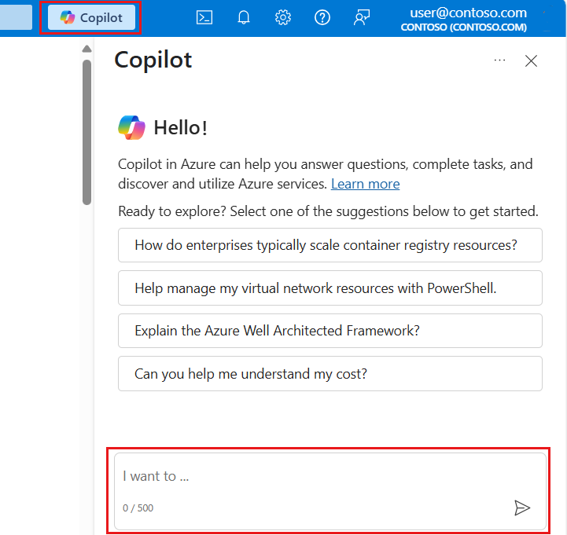

[Things](https://www.cnbc.com/2025/05/13/microsoft-is-cutting-3percent-of-workers-across-the-software-company.html) happened this week. I have an opinion... If this concerns you, feel free to reach out to chat, connect on LinkedIn, get a recommendation, etc.

Personally I am still here, and moving to another team, which is ok. In the past I have posted about Learn Knowledge Service and other product-content integrations, and will be doing that more going forward. 

[Azure portal copilot](./azure-portal-copilot)
[Azure copilot journey](./azure-copilot-journey)
[Azure copilot generally available](./azure-copilot-ga)

Thanks for reading! :-)
