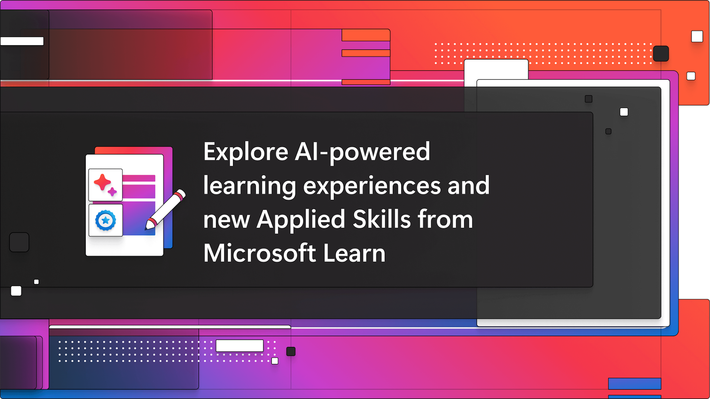

I was asked to help at Build, to staff the Learn booth and to coach the AI open hack. Staffing the booth is fun because you get to meet all kinds of people, well they are all Build attendees. Coaching the AI open hack is even more fun because teaching requires you to learn better, and you meet a smaller number of people with deeper conversations. Each was great. 

Additional benefits was that I could visit friends in Portland, Oregon! And obviously I could visit Seattle and attend Build. Plus I got to personally meet a number of colleagues who either live in the Seattle area or attended Build too. 

[Book of news](https://news.microsoft.com/build-2025-book-of-news/)

[Learn blog post](https://techcommunity.microsoft.com/blog/microsoftlearnblog/build-skills-that-matter%E2%80%94faster%E2%80%94with-ai-assisted-learning-and-applied-skills/4292262)

Thanks for reading! :-)
