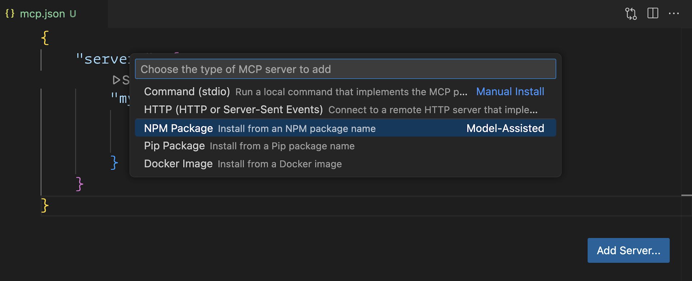

After working at Build in Seattle, it is back to business. I will be working a lot more with content-product integrations and specifically using Model Context Protocol (MCP). 

MCP Servers bring specific functions and data to AI agents and language models. My go-to MCP host and client are VS Code with GitHub Copilot agent mode. Check it out how that works. 

[Code blog post](https://code.visualstudio.com/blogs/2025/05/12/agent-mode-meets-mcp)

[Video](https://www.youtube.com/watch?v=VePxCcF99w4)

Thanks for reading! :-)
