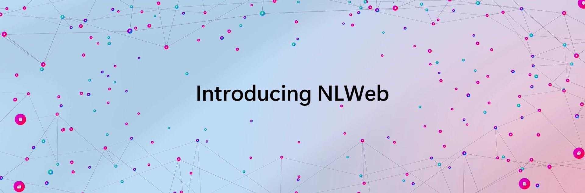

I have posted about MCP before. If you are interested in that space, you should also keep an eye out for related emerging technologies such as NLWeb and Agent2Agent. 

While this area is evolving quickly, it is clear that the web is expanding beyond browsers and humans. NLWeb builds on standards like schema.org and rss and has some fascinating concepts: For a website internally, NLWeb turns lists into a chat interface to interact with. Outside of a website, NLWeb is mentioning discoverability of content and MCP interfaces for agents. This space is new, so it is hard to tell where it is going and how fast. But if you are in the field of search engine optimizationg and web development, this should probably get your attention. 

[Build presentation](https://build.microsoft.com/en-US/sessions/BRK240)

[Blog post](https://news.microsoft.com/source/features/company-news/introducing-nlweb-bringing-conversational-interfaces-directly-to-the-web/)

Thanks for reading! :-)
