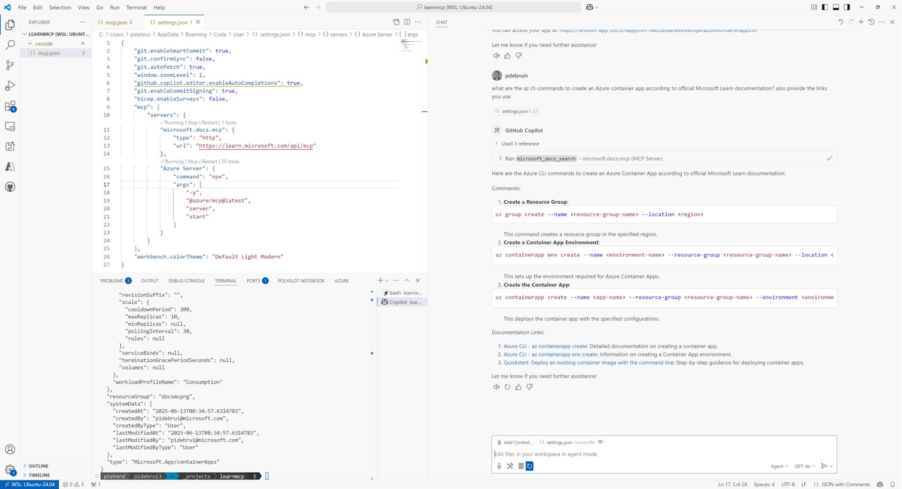

This week we made the Learn Docs MCP Server available as public preview. I am very excited by this because it combines Learn content in development environment for a better user experience. I will talk about this as a VS Code and GitHub Copilot user, but it is applicable to any MCP client that can connect to a remote model context protocol server using streamable hppt. 

In short, GitHub Copilot uses a language model to analyze your request and provide a response. This is a challenge since that language model was trained on generic web content and its training stopped when the model was released. Learn Docs MCP provides an interface for AI agents like GitHub Copilot, to ask a direct question to Learn, get max 10 results back, and shape an answer based on that trusted, up-to-date content. 

Interested? Give it a try. And share feedback in discussion, issues and pull requests. 

[Repository](https://github.com/microsoftdocs/mcp)

Thanks for reading! :-)
