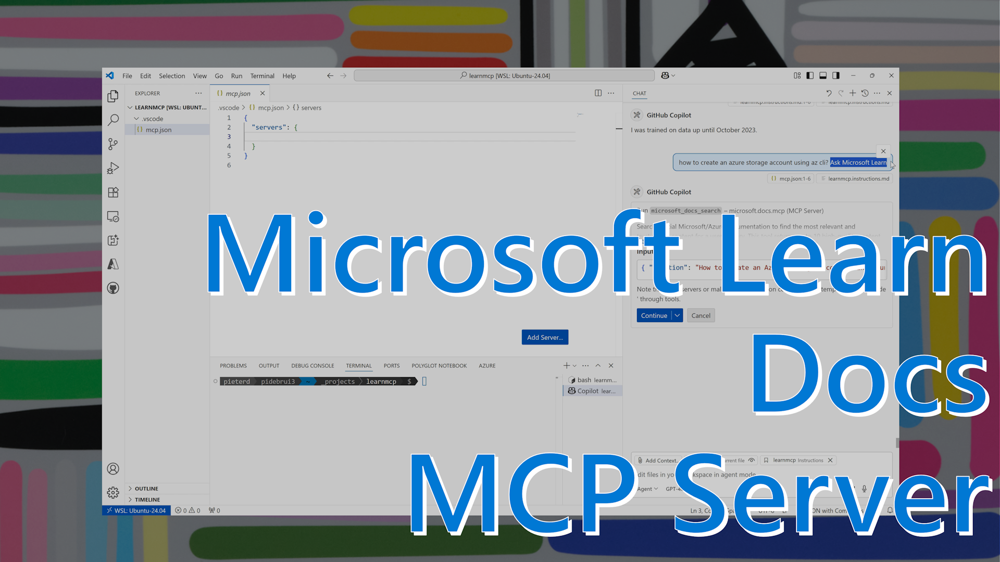

Disclaimer: I am not a professional youtuber, clearly :-) 

Sometimes a document helps to convey a message, other times it can be a visualization. Last month the Learn MCP Server was released publicly and lots of engineers started to experiment. Others who don't feel as comfortable with VS Code and GitHub Copilot or alternatives, have asked for a bit more guidance. The screen recording also helps to demonstrate the benefit of Learn MCP to non-techies who may not use it themselves, but can help spread the word. So feel free to use the video where relevant. And if you can do better, also feel free to do so :-)

Oh, in short the video covers why and how of Learn MCP Server in VS Code and GitHub Copilot agent mode. Connect with us in the GitHub repository through discussion, isssues, and pull requests. Or find me through other channels to share feedback so we understand what works and where we can improve. 

[Youtube video](https://www.youtube.com/watch?v=UkRRaKwmlHU)

Thanks for reading! :-)
