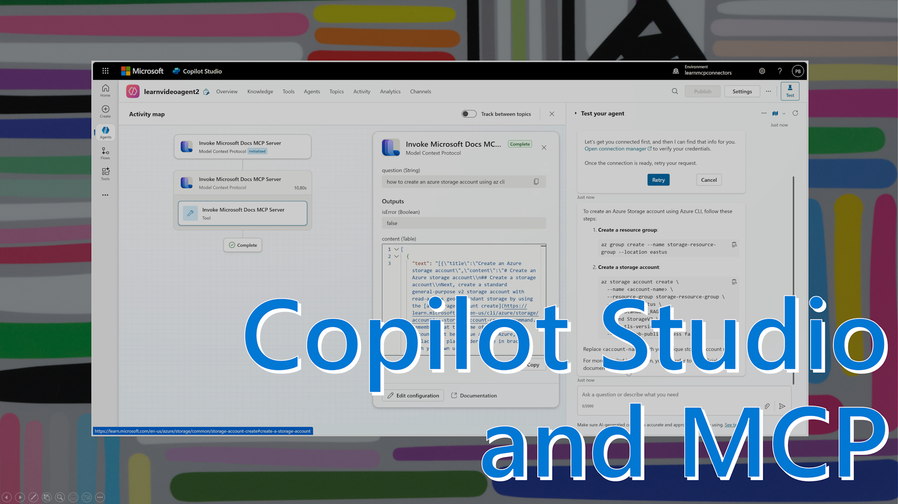

Disclaimer: I am not a professional youtuber, clearly :-) 

This is another video I created recently. The first was about using the Microsoft Learn MCP Server in VS Code GitHub Copilot. This one is related in the sense that it demonstrates Learn MCP too, but then in Copilot Studio. You see, MCP server are mostly used by agentic developer environment like GitHub Copilot, but that isn't a hard limit for the protocol. In fact, any client app that can connect with a remote MCP Server using streamable http can leverage trusted and up-to-date content in their AI agents. And Copilot Studio happens to be a popular way to build agents with low or no code. 

So soon after Learn MCP was released in public preview, people started asking about using it. The key piece was a swagger fragment, provided in a Learn article, and updated for Learn MCP by someone in the community. The video is mostly to educate people who are less familiar with Copilot Studio, MCP, or both, to show how to do it and what it looks like. 

Once you have that Copilot Studio agent, you can publish it Teams and have a conversation with it there about Learn content. This is useful for people, who don't use VS Code as their primary tool, for instance for support engineers who handle questions and tickets. 

[Video](https://www.youtube.com/watch?v=nfHWS1S6_pQ)

Thanks for reading! :-)
