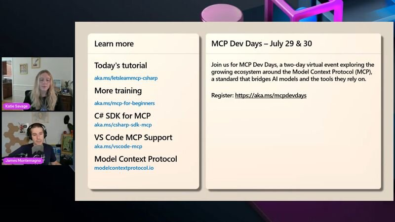

Let's learn MCP in C# just happened: Katie Savage and James Montemagno discussed: Why MCP, using MCP, and building an MCP Server. 

[Video](https://www.youtube.com/watch?v=4zkIBMFdL2w)

[Training](https://aka.ms/letslearnmcp-csharp)

Thanks for reading! :-)
